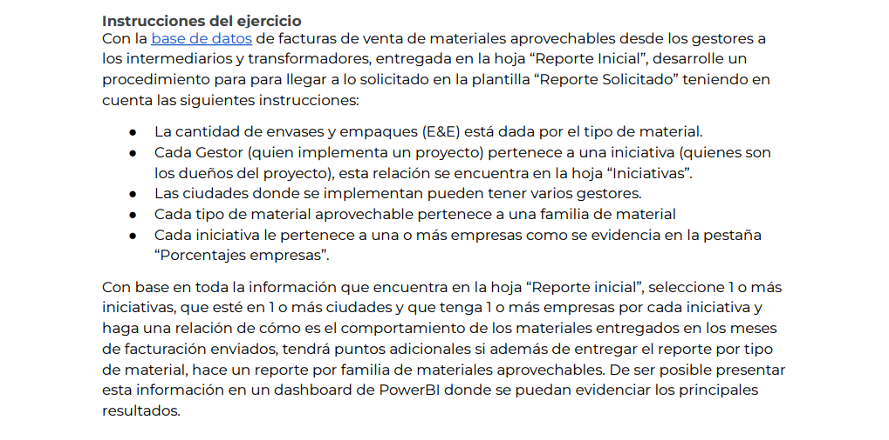
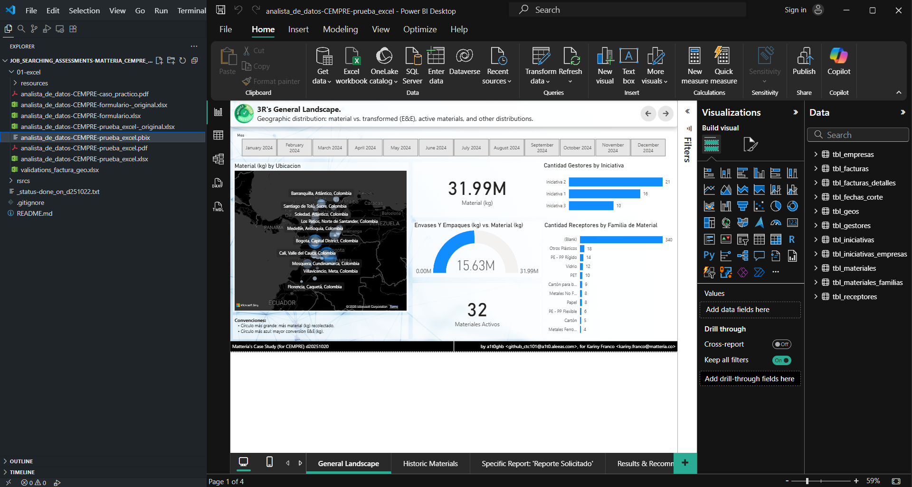
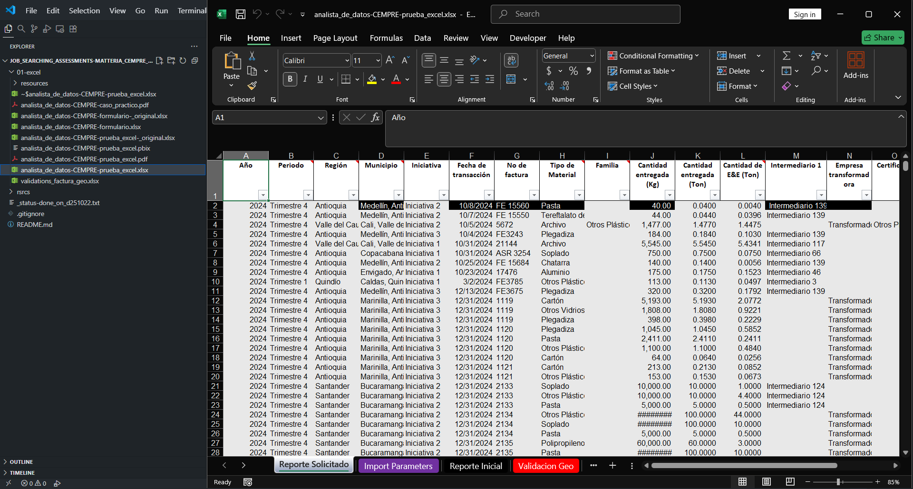
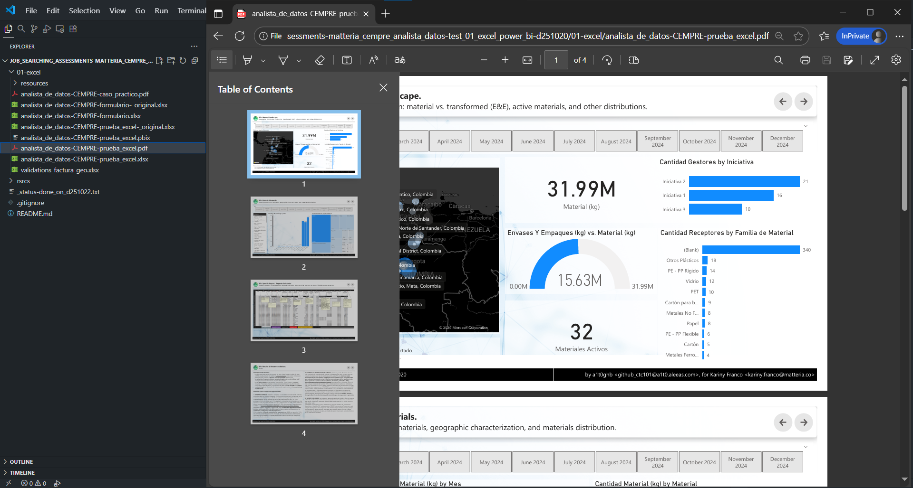

<!-- Badges:
- Source: 'https://shields.io/docs/static-badges', 'https://shields.io/badges/static-badge'.
- HTML structure followed: 'https://github.com/facebook/docusaurus/blob/main/README.md?plain=1'.
- Badges with logos: 'https://shields.io/docs/logos', 'https://simpleicons.org/', 'https://github.com/simple-icons/simple-icons/blob/master/slugs.md'.
- HTML <a> tag not redirecting: 'https://stackoverflow.com/questions/8260546/make-a-html-link-that-does-nothing-literally-nothing/8260561#8260561', 'https://www.geeksforgeeks.org/html/how-to-create-html-link-that-does-not-follow-the-link/'.
-->

<!-- Badge: WIP

  

 -->
<!--
🚧 WIP: section under construction. 🚧
-->

<!-- Badge: Done -->

  

<!-- README structure followed:
- 'https://www.aluracursos.com/blog/como-escribir-un-readme-increible-en-tu-github/'.
- 'https://github.com/camilafernanda/GlicoCare/'.
- 'https://github.com/nasa/openmct/'.
- 'https://github.com/facebook/docusaurus'.
-->

# [💼 Job Searching Assessment] Matteria, for CEMPRE: use Excel With Power BI to Analyze a Dataset About Recycling.

<!--

  🌐 '<a href="[URL for deployment]">[URL for deployment]</a>'

-->

 <!--
Enable autoplay of animated images:
- 'https://stackoverflow.com/questions/72508378/enable-gif-autoplay-on-github-readme/72509078#72509078'.
- 'https://github.com/orgs/community/discussions/47709'.
- 'https://github.com/settings/accessibility'.
Image width for GitHub READMEs:
- 'https://github.com/orgs/community/discussions/42424'.
- 'https://gist.github.com/uupaa/f77d2bcf4dc7a294d109'.
-->
<!-- 

    
     
    <figcaption><small>Fig.</small></figcaption>
     

  -->

    
     
    <figcaption><small>Fig. Power BI Dashboard.</small></figcaption>
     

This repo. contains the development for a technical assessment for the position of 'Analista de Datos', in the month of October, 2025.

<!-- Callouts:
- Improved format taken from examples in 'https://github.com/nasa/openmct/blob/master/README.md?plain=1'.
-->
> [!NOTE]
> This README is **mainly** written in english (en), but it might have some sections in spanish (sp), since assessment content is in spanish.

# 📝 Instructions.

Instructions from '[analista_de_datos-CEMPRE-caso_practico.pdf](./01-excel/analista_de_datos-CEMPRE-caso_practico.pdf)':

    
     
    <figcaption><small>Fig. Assessment instructions, in spanish (sp).</small></figcaption>
     

# ℹ Notes on Project Structure and Code Execution.

This project consists mainly of a **single** Power BI file, called '[analista_de_datos-CEMPRE-prueba_excel.pbix](./01-excel/analista_de_datos-CEMPRE-prueba_excel.pbix)' that anyone (*with a Windows machine*) can run with a [local installation of Power BI Desktop](https://www.geeksforgeeks.org/installation-guide/how-to-install-power-bi-on-windows/).

    
     
    <figcaption><small>Fig. Dashboard: Power BI file.</small></figcaption>
     

> [!IMPORTANT]
> The '.pbix' file has data in its cache, so you can open the file with Power BI Desktop and 'play' with the report, but if you want to **update / modify it's underlying data**, you'll require to update the the source data, which comes from the Excel file '[analista_de_datos-CEMPRE-prueba_excel.xlsx](./01-excel/analista_de_datos-CEMPRE-prueba_excel.xlsx)'

    
     
    <figcaption><small>Fig. Dashboard data source: Excel file.</small></figcaption>
     

**RESULTS & INSIGHTS FROM DASHBOARD.**

Results and insights for **this specific exercise**, can be found in detail in the '[.pbix](./01-excel/analista_de_datos-CEMPRE-prueba_excel.pbix)' file, in the tab 'Results & Recommendations', but are also available as a PDF export in the file '[analista_de_datos-CEMPRE-prueba_excel.pdf](./01-excel/analista_de_datos-CEMPRE-prueba_excel.pdf)'. **As you can imagine by now, in spanish only (sp)**.

    
     
    <figcaption><small>Fig. Dashboard results: PDF file.</small></figcaption>
     

If you got to this point, thank you so much for reading and hopefully this content can be helpful or informative in any way 🙇‍♂️.

Have a great day.

<!-- Embed dynamic content (image) of contributors:
- 'https://dev.to/lacolaco/introducing-contributors-img-keep-contributors-in-readme-md-gci'.
- 'https://contrib.rocks/'.
-->
# 🤝 Contributors.

Made with [contrib.rocks](https://contrib.rocks).

<!-- Authors table structure
- From repo: 'https://github.com/camilafernanda/GlicoCare/blob/main/README.md?plain=1'.
-->
# 📜 Authors.

| [ a1t0ghb](https://github.com/a1t0ghb) |
| :---: |

<!-- EOF. -->